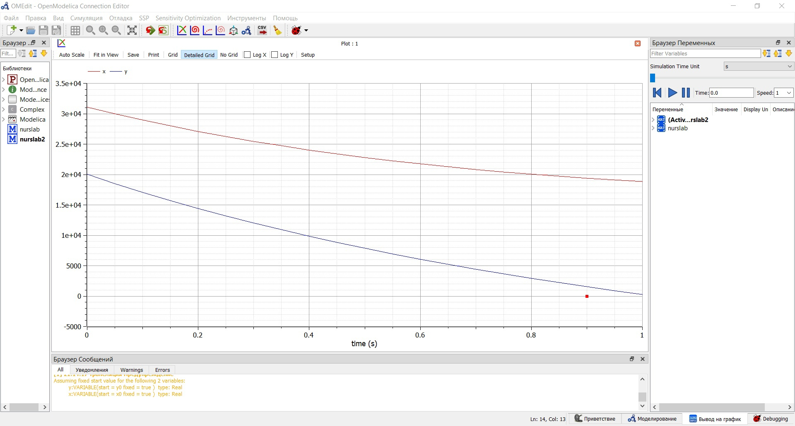
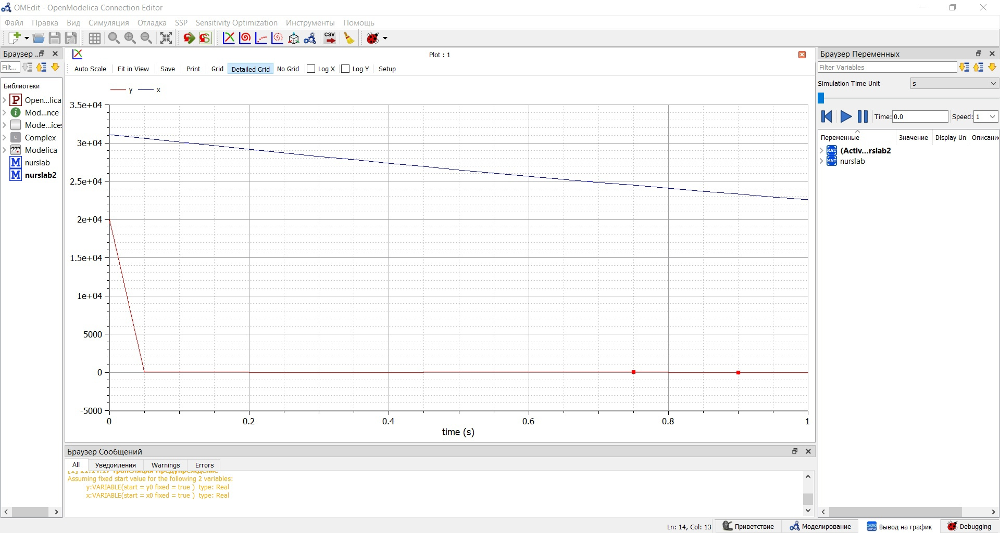

---
## Front matter
lang: ru-RU
title: Задача о погоне
author: Гаджиев Нурсултан Тофик оглы НПИ-01-18

institute: RUDN University

date: Математическое Моделирование--2021, 27 февраля, 2021, Москва, Россия

## Formatting
mainfont: PT Serif
romanfont: PT Serif
sansfont: PT Sans
monofont: PT Mono
toc: false
slide_level: 2
theme: metropolis
header-includes:
 - \metroset{progressbar=frametitle,sectionpage=progressbar,numbering=fraction}
 - '\makeatletter'
 - '\beamer@ignorenonframefalse'
 - '\makeatother'
aspectratio: 43
section-titles: true

---

# Цель лабораторной работы

Решить задачу о моделе боевых действий и построить графики с помощью OpenModelica

## Вариант 38

Между страной Х и страной У идет война. Численность состава войск исчисляется от начала войны,
и являются временными функциями x(t) и y(t). В начальный момент времени страна Х имеет
армию численностью 31 050 человек, а в распоряжении страны У армия численностью в 20 002
человек. Для упрощения модели считаем, что коэффициенты a b c h постоянны. Также считаем P(t)
и Q (t) непрерывные функции.

## Задание к лабораторной работе

Постройте графики изменения численности войск армии Х и армии У для следующих случаев:

 1. Модель боевых действий между регулярными войсками

  $\frac{dx}{dt}$= -0.25x(t) - 0.74y(t) + sin(t+5)

  $\frac{dy}{dt}$= -0.64x(t) - 0.55y(t) + cos(t+6)

 2. Модель ведение боевых действий с участием регулярных войск и партизанских отрядов

  $\frac{dx}{dt}$= -0.32x(t) - 0.89y(t) + 2sin(10t)

  $\frac{dy}{dt}$= -0.51x(t)y(t) - 0.62y(t) + 2cos(10t)

# Процесс выполнения лабораторной работы

## Выполнение работы

У нас в условии дано, что
в начальный момент времени страна Х имеет армию численностью 31 050 человек, а
в распоряжении страны У армия численностью в 20
002 человек. Для упрощения модели считаем, что коэффициентыa b c
h постоянны. Также считаем P(t) и Q (t) непрерывные функции.

## Построение модели боевых действий

### Начальные условии:

x0=31050

y0=20002;

a=0.25;

b=0.74;

c=0.64;

h=0.55;

Модель боевых действий между регулярными войсками

  $\frac{dx}{dt}$= -0.25x(t) - 0.74y(t) + sin(t+5)

  $\frac{dy}{dt}$= -0.64x(t) - 0.55y(t) + cos(t+6)

## Построение модели ведение боевых действий с участием регулярных войск и партизанских отрядов

### Начальные условии:

x0=31050

y0=20002;

a=0.32;

b=0.89;

c=0.51;

h=0.62;

Модель ведение боевых действий с участием регулярных войск и партизанских отрядов

  $\frac{dx}{dt}$= -0.32x(t) - 0.89y(t) + 2sin(10t)

  $\frac{dy}{dt}$= -0.51x(t)y(t) - 0.62y(t) + 2cos(10t)

# Результаты

## Для первого случая

{ #fig:001 width=70% }

## Для второго случая

{ #fig:002 width=70% }

# Выводы

Решил задачу о моделе боевых действий и построил графики с помощью OpenModelica
